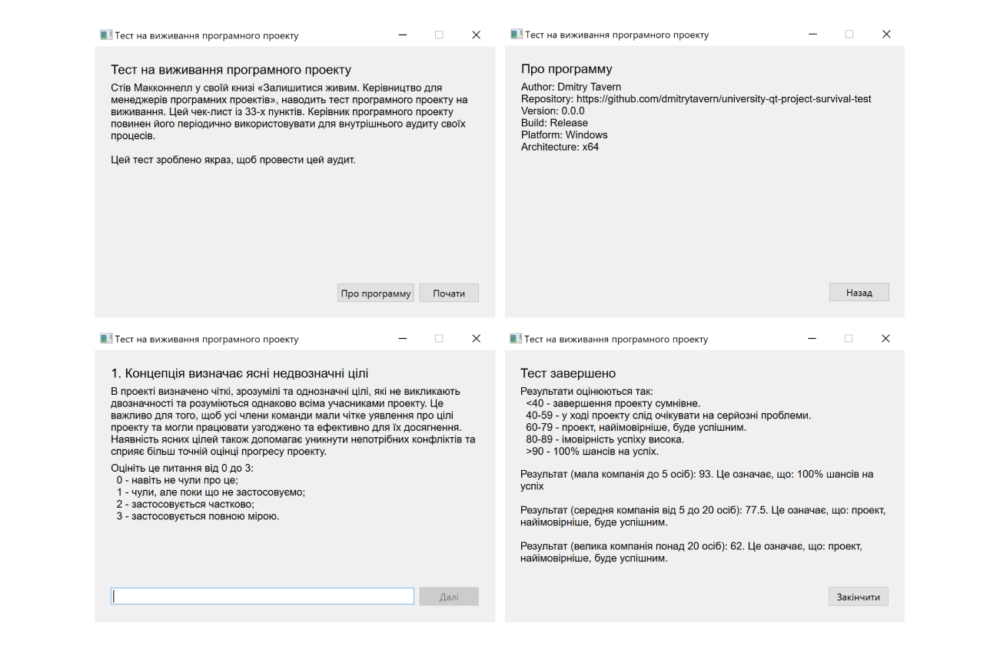

# Project survival test

Project written for the university. The main functionality is passing a test that counts the entered numbers and displays the result at the end.

## Motivation

- Gain knowledge and experience in C++/Qt6
- Understand how GitHub Actions work to automatically build a C++ project.
- Understand how project deployment works to be able to run it on other machines without installing Qt6.
- Automatic generation and addition of artifacts to the GitHub release.

## Result

When using the VSCode or MSVS C++ development environment, the project is fully built, launched and runs without issues.

With automatic builds using GitHub Actions, the projects are built successfully, but deployment only works for Windows.

There is a deployment issue on Linux when using linuxdeployqt, as the "libxkbcommon-x11.so.0" library is missing. Attempting to solve this issue by installing it via apt may result in the "Error stripping "libc.so"" problem. This problem can be resolved by adding the "-no-strip" flag to linuxdeployqt, which will then add the required libraries. However, the program can only be executed on Ubuntu and if Qt6 plugins are installed on it. However, this is not guaranteed.

## How to build a project

1. Using VSCode or MSVS C++. The project has presets for easy assembly in the IDE.

2. Using cmake. See the github workflows for your system for more details.
